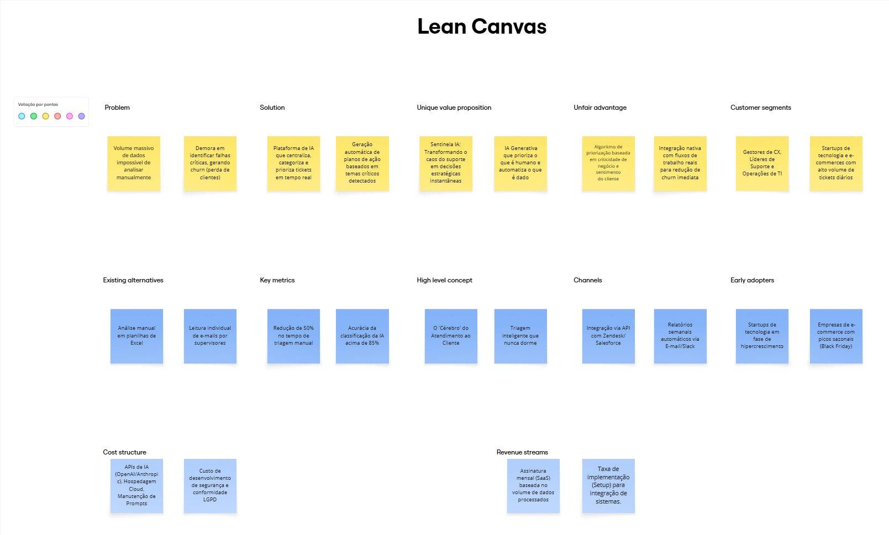
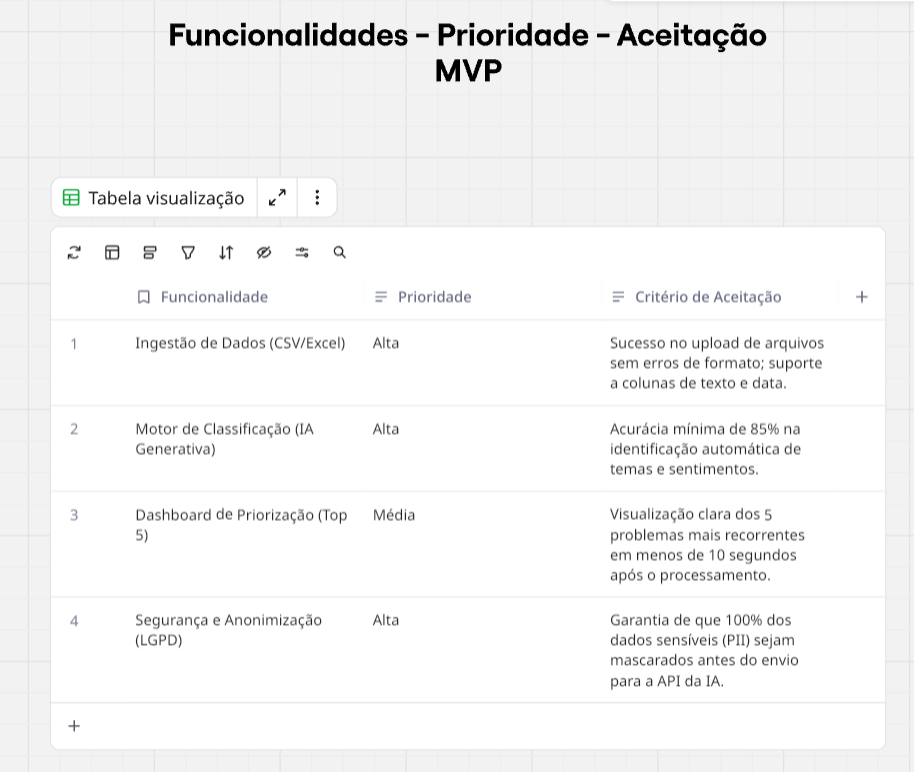
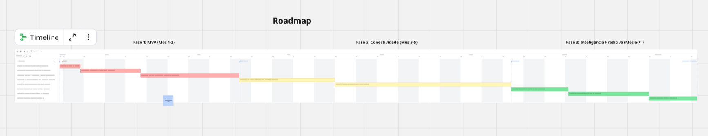
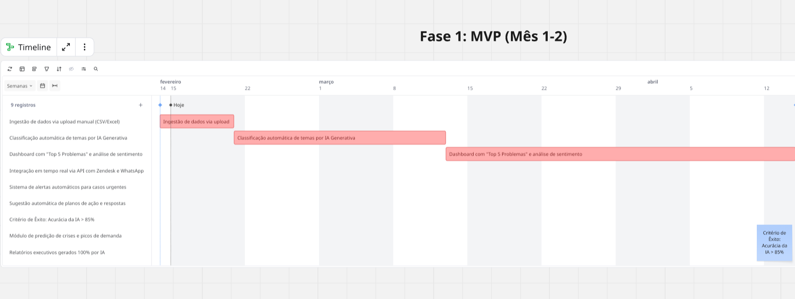
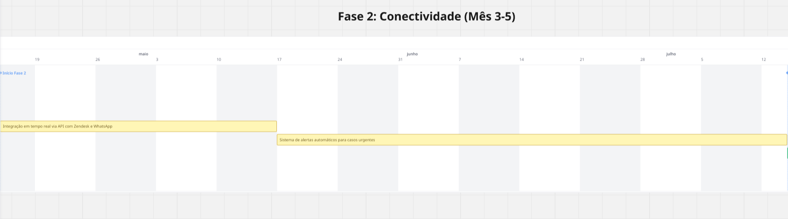
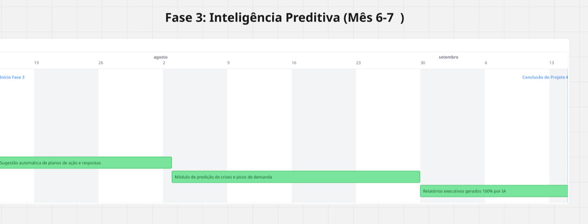
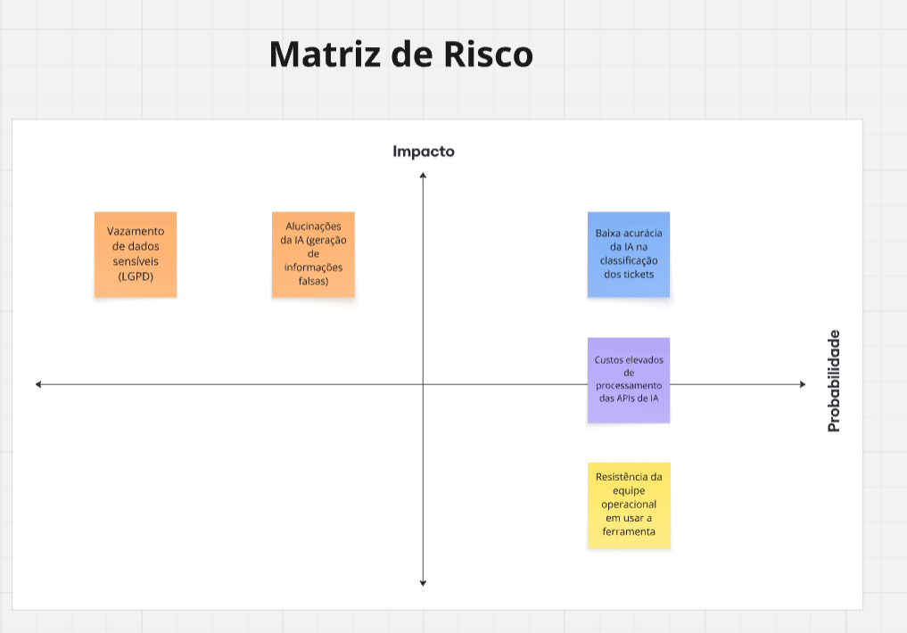
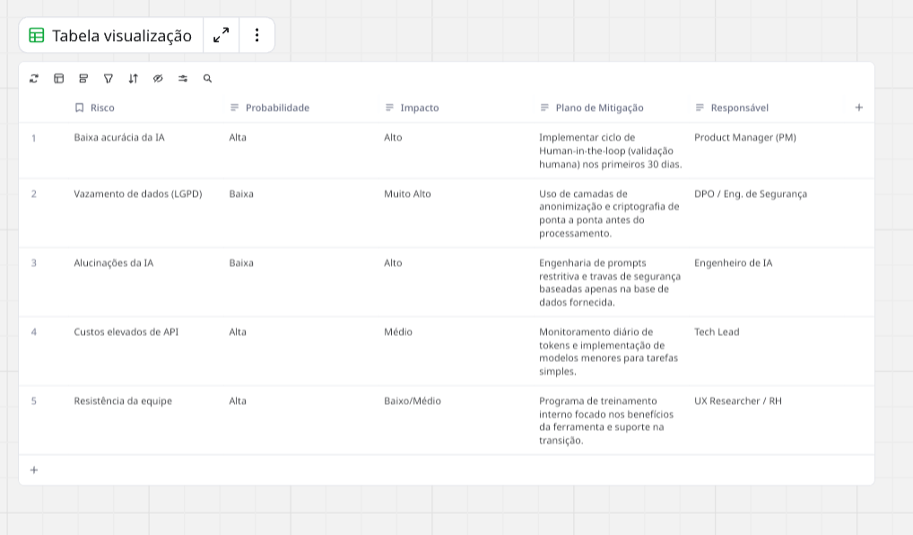

# 🤖Sentinela IA - Inteligência de Dados para Customer Experience

O **Sentinela IA** é uma solução de Inteligência Artificial Generativa desenvolvida para automatizar a triagem e análise de grandes volumes de interações de suporte. Este repositório centraliza o planejamento estratégico, prático e os artefatos de gestão que guiam o desenvolvimento do produto.

---

## 1. Visão Estratégica

O produto foca em resolver o gargalo operacional de gestores de CX que não conseguem priorizar temas críticos devido à sobrecarga de dados. A proposta é transformar conversas brutas em insights acionáveis e planos de ação automáticos em tempo real.

### 1.1 Lean Canvas

O modelo de negócio prioriza a eficiência operacional e a redução do churn através de uma triagem inteligente.

---

## 2. Planejamento do MVP (Minimum Viable Product)

O MVP foca na validação da acurácia da IA e na entrega de valor imediato através da interpretação de temas e sentimentos.

### 2.1 Detalhamento de Funcionalidades e Critérios de Aceitação

Abaixo, a tabela de priorização que define os requisitos mínimos para o sucesso do lançamento inicial.

---

## 3. Product Roadmap (Timeline de 7 Meses)

Nosso cronograma está dividido em três fases claras, evoluindo da validação técnica para a integração total e inteligência preditiva.

### 3.1 Visão Geral do Roadmap

Visualização macro de todas as fases e entregáveis do projeto.

### 3.2 Detalhamento por Fases

- **Fase 1: MVP (Mês 1-2):** Foco em ingestão de dados, classificação e atingimento da meta de 85% de acurácia.
  

- **Fase 2: Conectividade (Mês 3-5):** Integração via API com CRMs (Zendesk/Salesforce) e sistema de alertas em tempo real.
  

- **Fase 3: Inteligência Preditiva (Mês 6-7):** Implementação de análise de tendências e sugestões automáticas de planos de ação.
  

---

## 4. Gestão de Riscos

A governança do projeto utiliza uma matriz que correlaciona o impacto e a probabilidade de falhas técnicas e operacionais.

### 4.1 Matriz de Risco (Gráfico)

Posicionamento visual dos riscos identificados, como vazamento de dados e acurácia da IA.

### 4.2 Plano de Mitigação e Responsáveis (Tabela)

Detalhamento das ações para reduzir danos e os responsáveis por cada monitoramento.

---

## 5. Link Board no Miro:

🚀 https://miro.com/app/board/uXjVGBPY1Rs=/?share_link_id=933203807548

